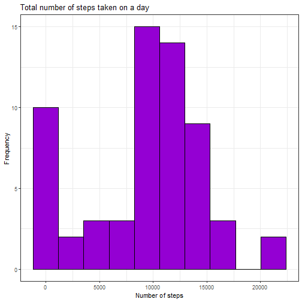
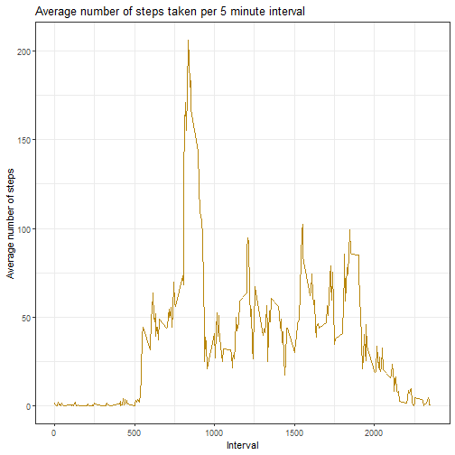
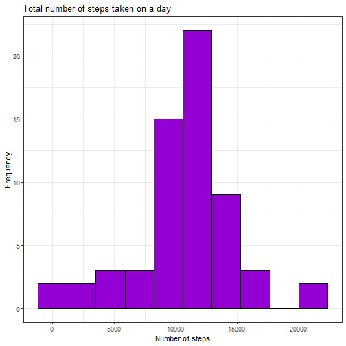
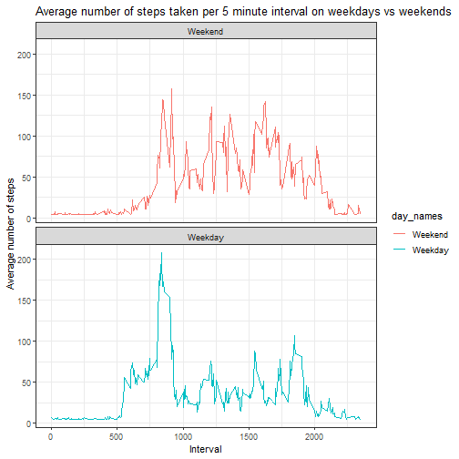

### Loading the necessary packages

```r
library(ggplot2)
library(dplyr)
```


## Loading and preprocessing the data

In this chunk, the data is loaded from the csv into the variable activity. Then, it is explored with the function str() and the second column is changed from character class into date class. 


```r
activity <- read.csv("activity.csv")
str(activity)
```

```
## 'data.frame':	17568 obs. of  3 variables:
##  $ steps   : int  NA NA NA NA NA NA NA NA NA NA ...
##  $ date    : chr  "2012-10-01" "2012-10-01" "2012-10-01" "2012-10-01" ...
##  $ interval: int  0 5 10 15 20 25 30 35 40 45 ...
```

```r
activity$date <- as.POSIXct(activity$date, format="%Y-%m-%d" )
```


## What is the mean total number of steps taken per day?

In this section, we obtain the sum of steps for each date and plot it as a histogram. 


```r
steps_by_day <- aggregate(activity$steps, by=list(activity$date), sum, na.rm=TRUE)
names(steps_by_day) <- c("Date", "Steps")

ggplot(steps_by_day, aes(x=Steps)) + geom_histogram(bins = 10,  fill="darkviolet", col="black") + labs(title="Total number of steps taken on a day", x = "Number of steps", y="Frequency") + theme_bw()
```



Next, we calculate the mean and median of the total number of steps taken per day.


```r
median_1 <- median(steps_by_day$Steps)
median_1
```

```
## [1] 10395
```

```r
mean_1 <- mean(steps_by_day$Steps)
mean_1
```

```
## [1] 9354.23
```

The mean is 9354.2295082, while the median is 10395.


## What is the average daily activity pattern?

In this section, we obtain the average number of steps for each 5 minute interval (across all days) and plot it as a time series.


```r
steps_by_inter <- aggregate(activity$steps, by=list(activity$interval), mean, na.rm=TRUE)
names(steps_by_inter) <- c("Interval", "Steps")

ggplot(steps_by_inter, aes(Interval, Steps)) + geom_line(col="darkgoldenrod") + labs(title="Average number of steps taken per 5 minute interval", x="Interval", y="Average number of steps") + theme_bw()
```



Furthermore, we calculate which 5-minute interval contains the maximum number of steps.


```r
max_inter <- steps_by_inter[which.max(steps_by_inter$Steps),]$Interval

max_inter
```

```
## [1] 835
```

The interval with the maximum number of steps is 835.

## Imputing missing values

First, we calculate how many missing values the original data set has. 

```r
nas <- length(which(is.na(activity)))

nas
```

```
## [1] 2304
```

The total number of NAs in the data set is 2304.


Next, we fill in the missing values using the mean number of steps for that interval and create a new data set with the missing data filled in.


```r
imputed <- steps_by_inter$Steps[match(activity$interval, steps_by_inter$Interval)]


steps_complete <- activity %>%
        mutate(steps= ifelse(is.na(steps), mean(steps, na.rm=TRUE), steps))


sum(is.na(steps_complete$steps))
```

```
## [1] 0
```
Done! The new data set has been created and it has 0 missing values.

Now, we create the histogram of the total number of steps taken each day for this new data set.


```r
steps_by_day_comp <- aggregate(steps_complete$steps, by=list(steps_complete$date), sum)
names(steps_by_day_comp) <- c("Date", "Steps")

ggplot(steps_by_day_comp, aes(x=Steps)) + geom_histogram(bins = 10,  fill="darkviolet", col="black") + labs(title="Total number of steps taken on a day", x = "Number of steps", y="Frequency") + theme_bw()
```



Next, we calculate the mean and median of the total number of steps taken per day with the new data.


```r
median_c <- median(steps_by_day_comp$Steps)
median_c
```

```
## [1] 10766.19
```

```r
mean_c <- mean(steps_by_day_comp$Steps)
mean_c
```

```
## [1] 10766.19
```

The mean is 1.0766189 &times; 10<sup>4</sup>, while the median is 1.0766189 &times; 10<sup>4</sup>. As we can see, the values differ from the previously calculated ones, being larger and both equal.

Imputing missing data seems to increase the estimates and make the data resemble a normal distribution more (this can also be seen in the histogram, which has a taller y axis), offering what is probably a more accurate estimation of the total and mean of the data as the one we can get with missing values. However, it cannot account for outliers or unexpected values.


## Are there differences in activity patterns between weekdays and weekends?

Here we create a factor variable that indicates whether a given date is a weekday or a weekend and then bind it to the dataset. 


```r
days <- unique(weekdays(steps_complete$date))
weekdays <- days[1:5]
weekends <- days[6:7]
day_names <- factor((weekdays(steps_complete$date) %in% weekdays), labels=c("Weekend", "Weekday"))

steps_complete <-cbind(steps_complete, day_names)
```

Next, we make a panel plot containing a time series plot of the intervals vs the average number of steps taken. 


```r
steps_by_inter_c <- aggregate(steps ~ interval + day_names, steps_complete, mean)

ggplot(steps_by_inter_c, aes(interval, steps, color=day_names)) + geom_line() + labs(title="Average number of steps taken per 5 minute interval on weekdays vs weekends", x="Interval", y="Average number of steps") + theme_bw() + facet_wrap(~day_names, ncol=1)
```


```
